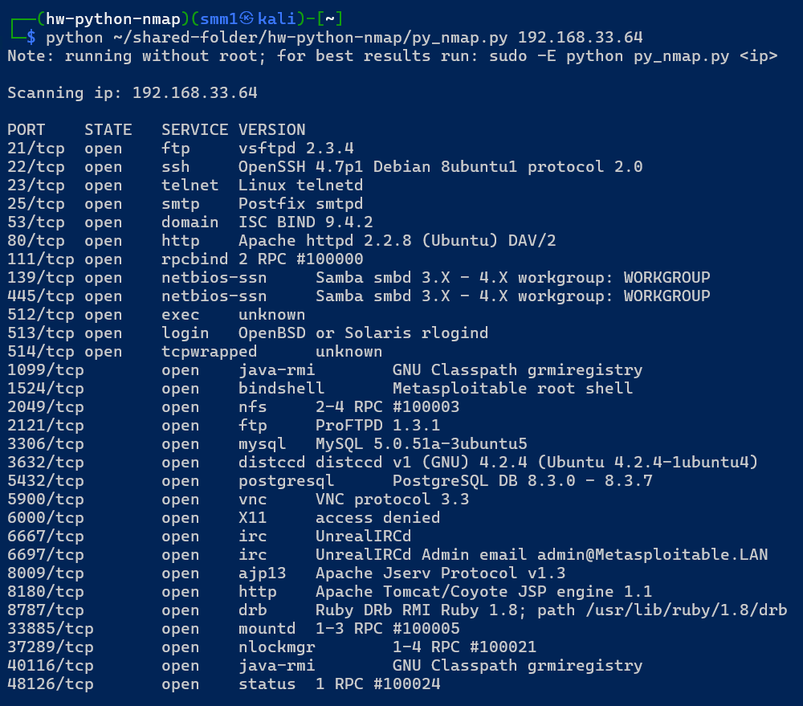

# Домашнее задание к занятию «Язык Python в информационной безопасности»

В качестве результата пришлите ответы на вопросы в личном кабинете студента на сайте [netology.ru](https://netology.ru/).

**Важно**: перед отправкой переименуйте ваш скрипт в `script.txt` (система отправки файлов Netology блокирует файлы с расширением `.py`).

## Задание 1

Просканируйте с помошью Python ВМ Metasploitable. Определите установленные службы (нужно вывести название и версию службы, номер порта.)

## Решение

Написал [скрипт](py_nmap.py). 

Результат:

Запускал не тод рутом так как работал в виртуальном окружении что бы не было проблем с установкой пакетов.

P.S. Врое задание возможно будет позже, когда догоню учебный процесс.