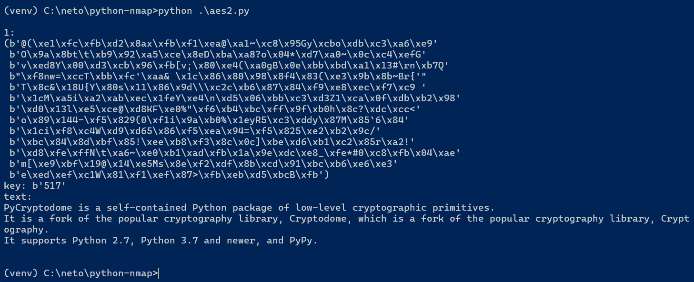

# Домашнее задание к занятию «Язык программирования Python. Криптография.»

В качестве результата пришлите ответы на вопросы в личном кабинете студента на сайте [netology.ru](https://netology.ru/).

**Важно**: перед отправкой переименуйте ваш скрипт в `script.txt` (система отправки файлов Netology блокирует файлы с расширением `.py`).

## Задание 1

Реализуйте атаку грубой силой на текст, зашифрованный AES. В качестве пароля возьмите трёхзначное число.

Примечание: вместо **pip install *cryptodome*** сейчас лучше использовать **pip install *pycryptodome***, - это обновлённый пакет криптографии для Python. Более подробую информацию можно посмотреть вот здесь: [Installation pycryptodome](https://pycryptodome.readthedocs.io/en/latest/src/installation.html?highlight=Cryptodome#compiling-in-linux-ubuntu)

## Решение

Предложенный в материалах заняти код преобразовал в две функции - [encrypt_aes и decrypt_aes](aes2.py).

Теперь функции можно испоьльзовать в [коде](aes.py)).

Результат подбора ключа `517`.

